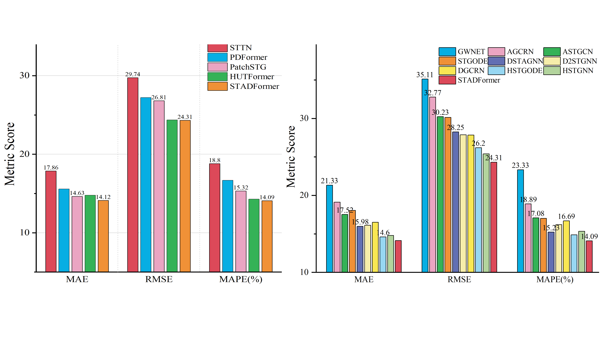

# DDFormer: Dual-Domain Transformer with Flexible Channel Dependence Strategy for Time Series Anomaly Detection

[](INSERT_YOUR_PAPER_URL_HERE)
[](https://www.python.org/)
[](https://pytorch.org/)

This repository contains the official implementation of **DDFormer**, a Transformer-based model for Multivariate Time Series Anomaly Detection (MTSAD). [cite_start]DDFormer effectively addresses "cross-channel contamination" and multi-scale temporal modeling through a dual-domain approach [cite: 14-16].

---

## 🌟 Research Highlights

* [cite_start]**Flexible Channel Dependence (FCD) Strategy**: Mitigates cross-channel contamination by establishing selective and directed channel interactions[cite: 3, 46].
* [cite_start]**Dual-Domain Fusion**: Measures inter-channel correlations by adaptively fusing time- and frequency-domain information[cite: 4, 15].
* [cite_start]**Comprehensive Multi-Scale Modeling**: Employs multi-scale patching and a Global-Local attention mechanism to capture dependencies across different temporal resolutions and spans[cite: 5, 18].
* [cite_start]**State-of-the-Art Performance**: DDFormer achieves an average improvement of **7.12% in F1-score** over existing SOTA methods across five benchmark datasets[cite: 6, 19].

---

## 🏗️ Architecture & Methodology

[cite_start]DDFormer jointly models temporal and channel dimensions through six core stages: Input Normalization, Frequency & Time Channel Distance Layer (FTCD), Channel Mask Encoding, Multi-Scale Patching, Global-Local Attention, and Contrastive Learning [cite: 191-196].


[cite_start]*Figure 1: Overall framework of DDFormer, detailing the Channel Mask Encoder and Global-Local Attention modules[cite: 190].*

### Channel Mask Encoder (CME)
[cite_start]The CME utilizes a **Gumbel-Softmax** reparameterization trick to generate a differentiable, sparse, and directed binary mask[cite: 290, 293]. [cite_start]This ensures that only relevant channels provide information guidance, preserving the robustness of channel independence where necessary[cite: 270, 276].


[cite_start]*Algorithm 1: Workflow of the Channel Mask Encoder[cite: 320].*

---

## 📊 Performance

[cite_start]DDFormer was evaluated on five real-world datasets: **MSL, NIPS-TS-GECCO, SMAP, SMD, and SWAT** [cite: 442-447].


[cite_start]*Figure 2: Performance comparison highlighting DDFormer's superiority in Precision, Recall, and F1-score[cite: 531].*

[cite_start]Compared to baseline averages, DDFormer achieves[cite: 493]:
* **Precision**: +10.7%
* **Recall**: +5.23%
* **F1-score**: +5.13%

---

## 🚀 Getting Started

### Environment Requirements
* [cite_start]**Python**: 3.12 [cite: 485]
* [cite_start]**PyTorch**: 2.5.1 [cite: 485]
* [cite_start]**CUDA**: 12.4 [cite: 485]
* [cite_start]**Hardware**: One NVIDIA V100 GPU (32GB) recommended[cite: 484].

### Installation
```bash
git clone [https://github.com/YourUsername/DDFormer.git](https://github.com/YourUsername/DDFormer.git)
cd DDFormer
pip install -r requirements.txt
