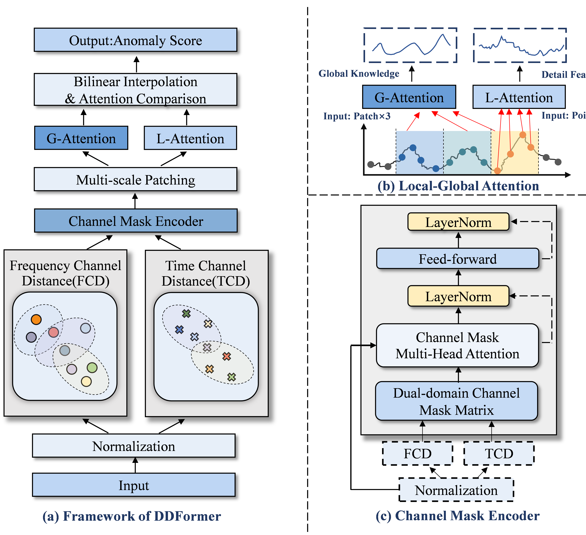
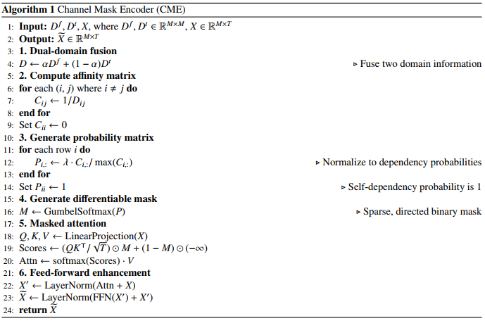
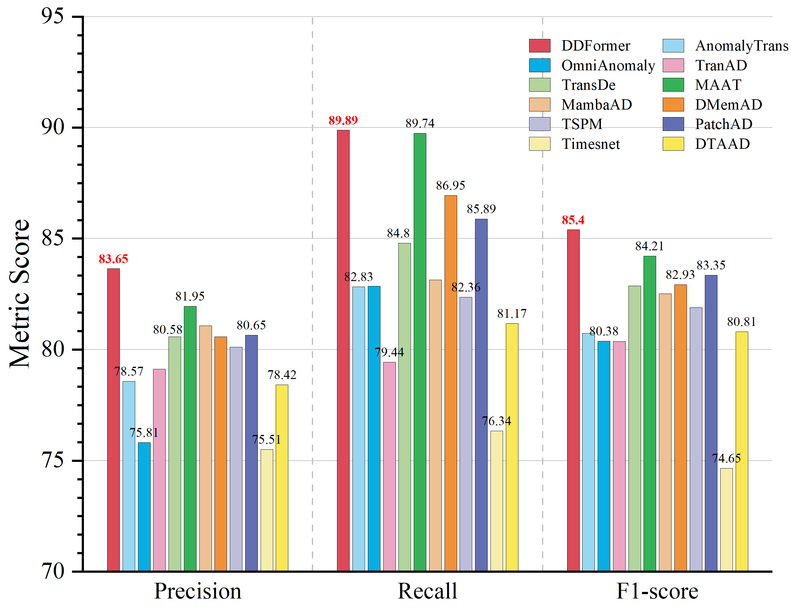

# DDFormer: Dual-Domain Transformer with Flexible Channel Dependence Strategy for Time Series Anomaly Detection

[](#)
[](https://www.python.org/)
[](https://pytorch.org/)


This repository contains the official PyTorch implementation of the paper: **"Dual-Domain Transformer with Flexible Channel Dependence Strategy for Time Series Anomaly Detection"**. DDFormer effectively addresses "cross-channel contamination" and multi-scale temporal modeling through a dual-domain approach, preventing system failures in real-world applications.

---

## 📖 Table of Contents
- [🌟 Research Highlights](#-research-highlights)
- [🏗️ Architecture & Methodology](#️-architecture--methodology)
- [📊 Performance](#-performance)
- [🚀 Getting Started](#-getting-started)
- [⚠️ Troubleshooting & Version Issues](#️-troubleshooting--version-issues)
- [🖋️ Citation](#️-citation)
- [🙏 Acknowledgements](#-acknowledgements)

---

## 🌟 Research Highlights

* **Flexible Channel Dependence (FCD) Strategy**: Mitigates cross-channel contamination by establishing selective and directed channel interactions.
* **Dual-Domain Fusion**: Measures inter-channel correlations by adaptively fusing time-domain and frequency-domain information.
* **Comprehensive Multi-Scale Modeling**: Employs multi-scale patching and a Global-Local attention mechanism to capture dependencies across different temporal resolutions and spans.
* **State-of-the-Art Performance**: DDFormer achieves an average improvement of **7.12% in F1-score** over existing SOTA methods across five benchmark datasets.

---

## 🏗️ Architecture & Methodology

DDFormer jointly models temporal and channel dimensions through six core stages: Input Normalization, Frequency & Time Channel Distance Layer (FTCD), Channel Mask Encoding, Multi-Scale Patching, Global-Local Attention, and Contrastive Learning.


*Figure 1: Overall framework of DDFormer, detailing the Channel Mask Encoder and Global-Local Attention modules.*

### Channel Mask Encoder (CME)
The CME utilizes a **Gumbel-Softmax** reparameterization trick to generate a differentiable, sparse, and directed binary mask. This ensures that only relevant channels provide information guidance, preserving the robustness of channel independence where necessary.




*Algorithm 1: Workflow of the Channel Mask Encoder.*

---

## 📊 Performance

DDFormer was rigorously evaluated on five real-world datasets: **MSL, NIPS-TS-GECCO, SMAP, SMD, and SWAT**. 


*Figure 2: Performance comparison highlighting DDFormer's superiority in Precision, Recall, and F1-score.*

Compared to baseline averages, DDFormer achieves remarkable improvements:
* **Precision**: +10.7%
* **Recall**: +5.23%
* **F1-score**: +5.13%

---

## 🚀 Getting Started

### Environment Requirements
* **Python**: 3.12
* **PyTorch**: 2.5.1
* **CUDA**: 12.4
* **Hardware**: One NVIDIA V100 GPU (32GB memory) is recommended.

### Installation
```bash
# Clone the repository
git clone [https://github.com/YourUsername/DDFormer.git](https://github.com/YourUsername/DDFormer.git)
cd DDFormer

# Create a folder for figures and add your images (Figure_3.png, image_8dab4c.png, duibi.png)
mkdir figures

# Install dependencies
pip install -r requirements.txt
```

### Usage
```bash
# Example: Train and test on the SMD dataset
python main.py --dataset SMD --batch_size 128 --hidden_dim 256 --n_heads 4 --lr 0.0001
```

---

## ⚠️ Troubleshooting & Version Issues

If you encounter issues during setup or execution, please refer to the solutions below:

### 1. NumPy 2.0 Compatibility Error
**Error Log:**
```plaintext
AttributeError: `np.Inf` was removed in the NumPy 2.0 release. Use `np.inf` instead.
```
**Solution:** This is due to the removal of the uppercase alias in NumPy 2.0. To fix this, locate the line in `solver.py` (typically around line 34) and change `np.Inf` to the lowercase version:
```python
# Change this:
self.val_loss_min = np.Inf

# To this:
self.val_loss_min = np.inf
```

### 2. CUDA Initialization & Driver Version
**Error Log:**
```plaintext
UserWarning: CUDA initialization: The NVIDIA driver on your system is too old (found version 12080).
```
**Solution:** Your current NVIDIA driver version does not support the latest PyTorch/CUDA 12.4 build. Please either:
* Update your NVIDIA GPU driver to the latest version.
* Install a specific PyTorch version compiled for your existing older driver (visit pytorch.org for previous version installation commands).

### 3. FileNotFoundError (Checkpoint Missing)
**Error Log:**
```plaintext
FileNotFoundError: [Errno 2] No such file or directory: 'checkpoints/..._checkpoint.pth'
```
**Solution:** Ensure you run the **Train** phase completely before attempting the **Test** phase. The testing script requires the saved `.pth` checkpoint file generated upon completion of training.

---

## 🖋️ Citation

If you find DDFormer useful for your research, please consider citing our paper:


## 🙏 Acknowledgements

We extend our sincere gratitude to the open-source community, specifically the following projects, which provided valuable code structures and references for our work:
* **EmorZz1G/PatchAD**: For insights into lightweight, patch-based MLP-Mixer architectures for anomaly detection.
* **thuml/Anomaly-Transformer**: For foundational work on Time Series Anomaly Detection with Association Discrepancy (ICLR 2022 Spotlight).

This research was funded by the National Natural Science Foundation of China (No. 62166015, No. 62166013).
```
